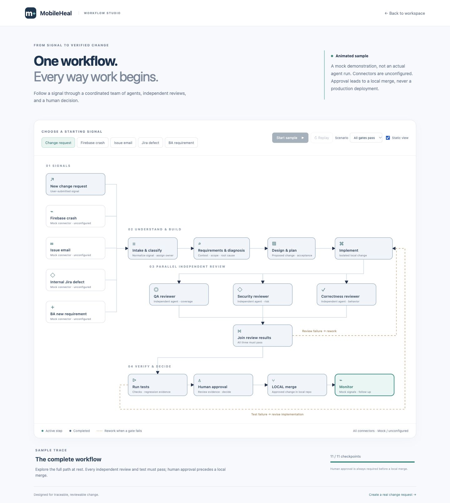
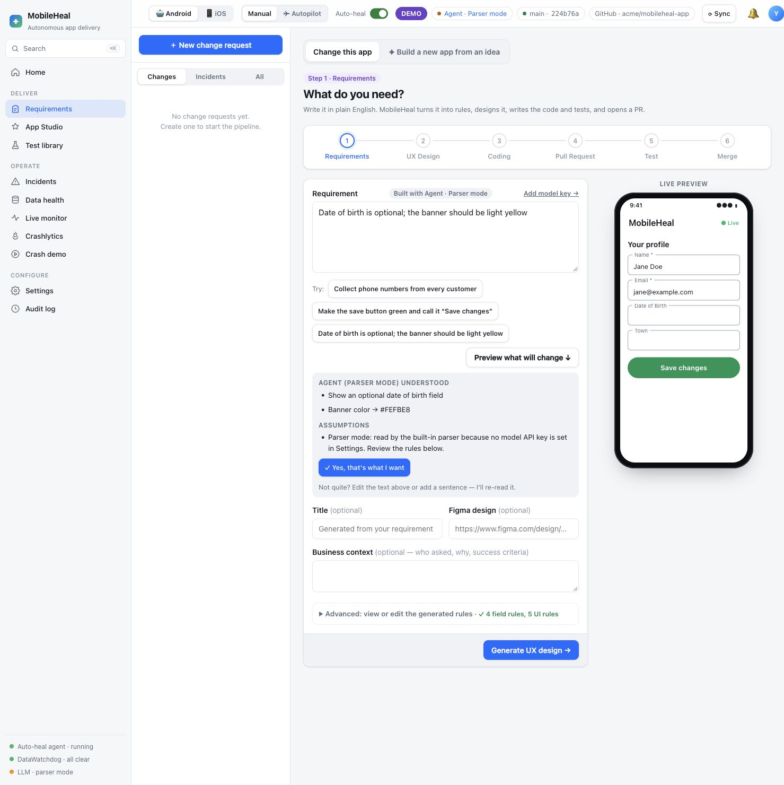
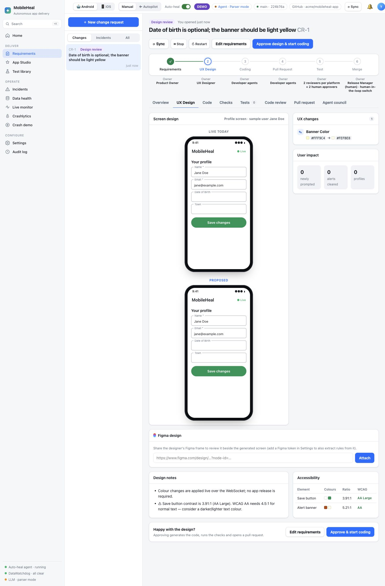
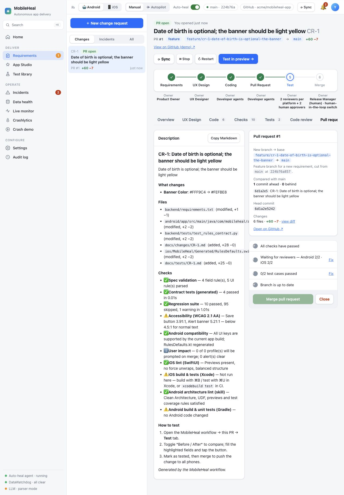
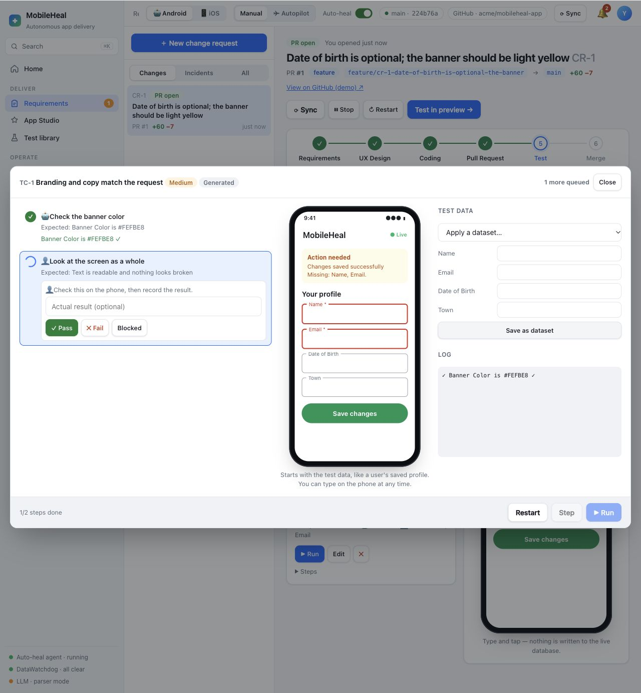
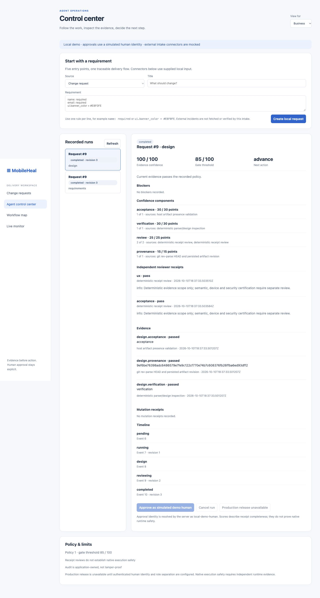
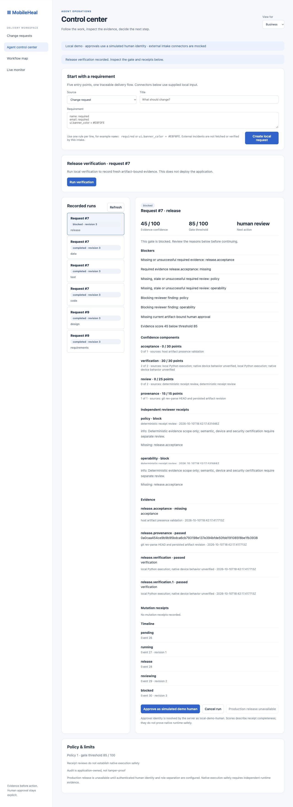
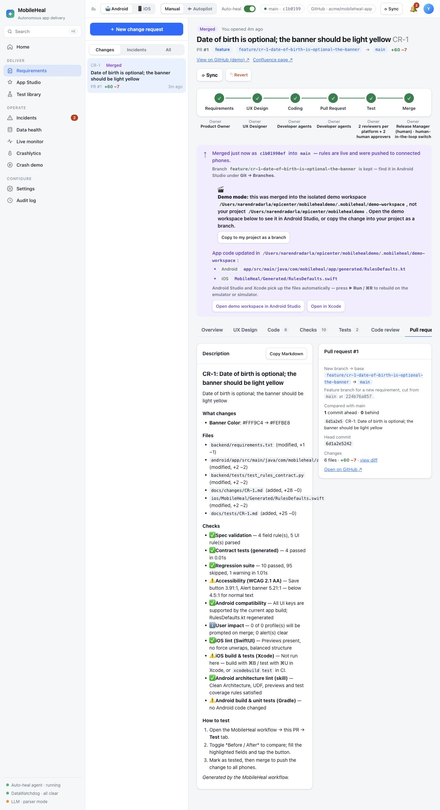
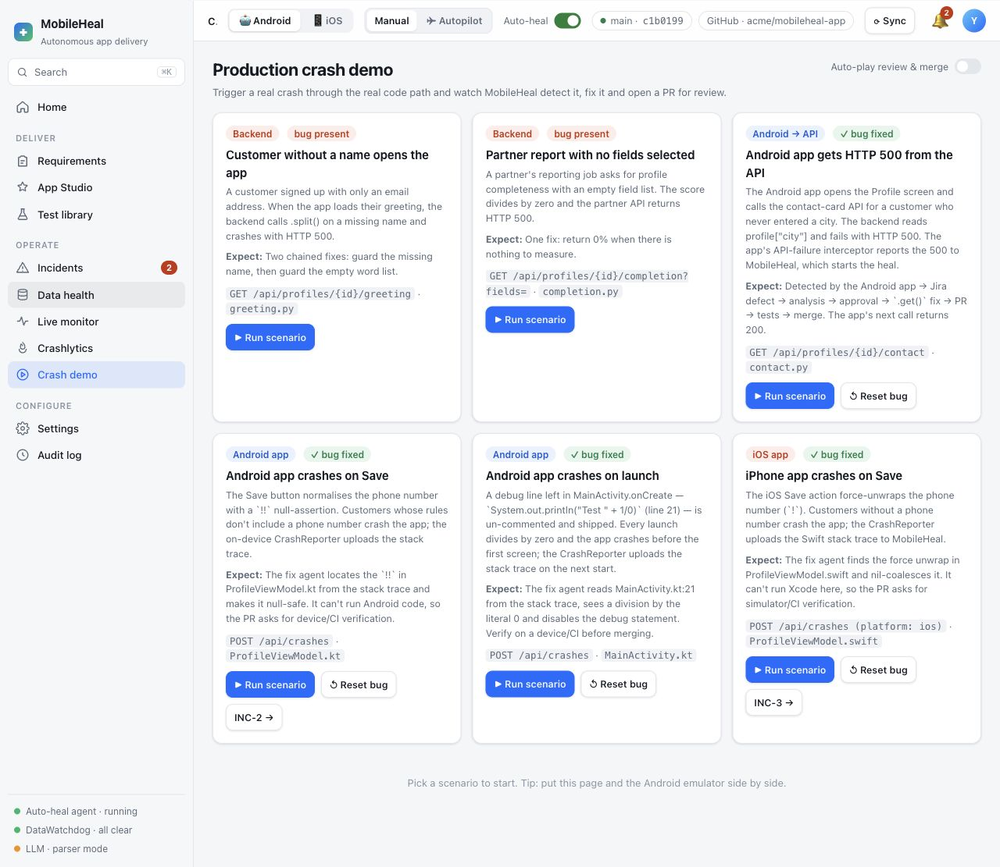
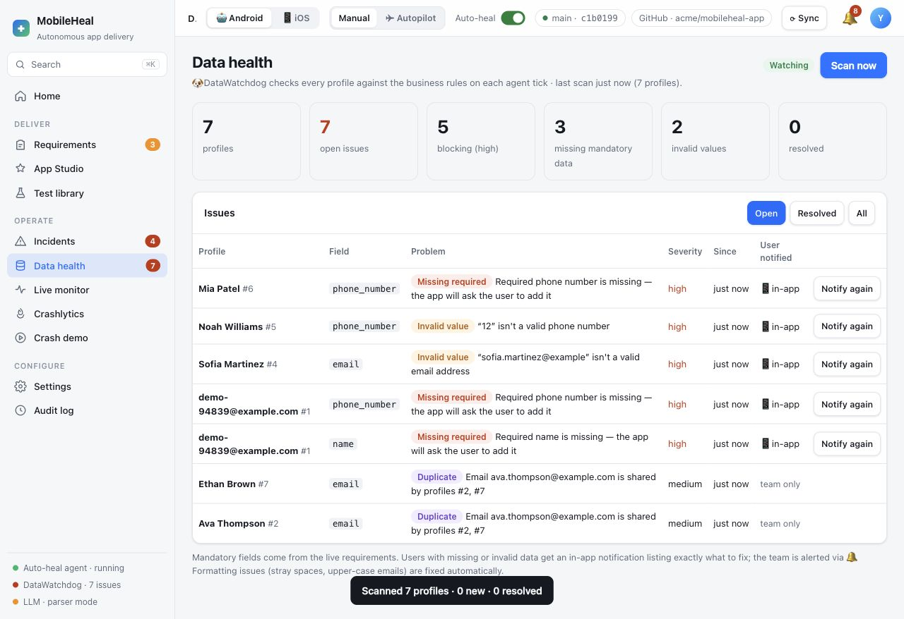

# MobileHeal: from requirement to recovery

A hands-on lab for autonomous mobile delivery · About 45 minutes · No API key required

<!-- step: Introduction | 2 | START HERE -->
## A change request. A reviewable result.

You will take a plain-English requirement through design, code generation, pull request review, testing, and a local merge. Then you will explore crash recovery and data quality in the same application.

The story is a customer profile screen. A product owner wants a softer notification banner and an optional date of birth. You will see how that sentence becomes explicit rules, how those rules become a diff, and how tests keep the change accountable.

### The architecture: one workspace, a focused crew

{{diagram architecture}}

*Architecture overview. The portal sends requests to the FastAPI backend. Delivery workflow, Crash healer and DataWatchdog share the local application context. Git holds generated changes; SQLite holds profiles and workflow state. Mobile clients use the API and live WebSocket updates. External services are simulated in this demo.*

### The workflow: proposal, approval, evidence

{{diagram delivery}}

*Delivery follows Requirements → UX design → Code → Pull request → Tests → Local merge. Human decisions guard the Manual-mode gates. A crash or data issue enters a recovery path: detect and diagnose, propose a fix or corrective action, review and verify, then replay the failing request or rescan the data. Data issues can also require a customer to update a record.*

### Follow the animated workflow

Open [Workflow studio](http://localhost:8000/workflow-map) to follow five starting signals: a change request, Firebase crash, issue email, internal Jira defect or BA requirement. Choose a passing or rework scenario, then start, pause or replay it. Static view supports reduced motion. This diagram is a labeled sample; unconfigured connectors use mock signals, and the animation does not represent a live agent run.



### The enterprise path: crash to production

{{diagram enterprise}}

*A Crashlytics crash becomes an incident, the seven-agent council writes the root cause, and a requirement gap opens a change request. Every step has an owner; in Autopilot a bot owns them. Two agents (Autopilot) or two people (Manual) approve the PR, and it waits ready to deploy until a person flips the production switch.*

### What you will learn

- Translate a business request into inspectable field and UI rules.
- Compare the current screen with a proposed design before approving code generation.
- Inspect a branch, generated tests, reviewer feedback, and merge gates.
- Reproduce a demo failure and follow its incident through a fix.
- Scan synthetic customer records for missing or invalid data.

### What you will build

A local MobileHeal workspace with a reviewed profile-screen change. The web workflow is the core lab; Android and iOS clients are optional extensions.

> DEMO BOUNDARY: Local Git branches and commits are real. Jira, Figma, GitHub/GitLab and other integrations are simulated in demo mode. A link marked “GitHub (demo)” opens a local page, not a public pull request.

### Your route through the lab

1. Install and start a separate demo workspace.
2. Write the requirement and review the interpretation.
3. Approve the design and inspect the generated change.
4. Run tests, satisfy review gates, and merge locally.
5. Explore crash recovery and data health.

### Before you begin

Use a terminal and a modern browser on macOS, Linux, or Windows with WSL. You do not need an LLM subscription, cloud project, or API key for the core lab. Keep this guide and MobileHeal in separate tabs.

<!-- step: Run tutorial and application | 1 | SETUP -->
## 1) Tutorial

```bash
bash run-tutorial.sh
```

## 2) Application

```bash
bash run-application.sh
```

<!-- step: Run the application | 1 | SETUP -->
## 2) Application

```bash
bash run-application.sh
```

<!-- step: Orient yourself | 2 | DELIVERY -->
## One portal, two kinds of work

MobileHeal groups planned changes under Deliver and operational work under Operate. Use **Manual** delivery mode for this lab so each approval remains visible.

### Deliver

- **Requirements** tracks each change through its delivery stages.
- **App Studio** explores building a new app from an idea; it is outside this profile-change exercise.
- **Test library** holds reusable test cases.

### Operate

- **Incidents** tracks failures and recovery work.
- **Data health** reports missing fields, invalid values and duplicates.
- **Crash demo** provides repeatable failures for demonstrations.

### Configure

**Settings** contains demo controls, optional integrations and delivery policy. **Audit log** records actions. Leave external integrations simulated for the core lab.

> CHECKPOINT: Open **Requirements** and select **New change request**. Confirm the Android platform is selected. Keep Manual delivery mode enabled for the walkthrough.

<!-- step: Write a requirement | 3 | DELIVERY -->
## Say what should change

At [New change request](http://localhost:8000/#new), choose **Change this app**. Enter this requirement, or use its suggestion button:

```text
Date of birth is optional; the banner should be light yellow
```

Select **Preview what will change ↓** if the interpretation is not already visible. Read the understood changes and assumptions. Confirm with **Yes, that's what I want** when they match your intent.



*Figure 1. The parser exposes its interpretation before a change request is created. The preview uses synthetic profile data.*

### What to inspect

- Date of birth is optional.
- The proposed banner color is a light yellow; the captured run used `#FEFBE8`.
- Name and email remain required.
- Parser mode is explicitly identified in the assumptions.

Open **Advanced: view or edit the generated rules** when you need to inspect the exact specification. An optional field may already be optional; that is expected. The banner color provides the visible change in this exercise.

Select **Generate UX design →**. MobileHeal creates a change request and opens design review. Your identifier may differ from the screenshots.

> CHECKPOINT: You have a change request in Design review. If the interpretation differs from your request, edit the text or rules before generating the design.

<!-- step: Review the design | 3 | DELIVERY -->
## Approve the screen before the code

Open the change request's **UX Design** tab. Compare **Live today** and **Proposed**. Read the UX changes, user impact, design notes, and accessibility results.



*Figure 2. Design review shows the banner token changing from `#FFF9C4` to `#FEFBE8`. No profiles existed yet in this captured run, so user-impact counts were zero.*

### Review deliberately

1. Confirm the requested field behavior and banner color.
2. Check whether any existing profiles will need attention.
3. Read accessibility warnings instead of treating a rendered preview as sufficient validation.
4. Use **Edit requirements** if the proposal needs correction.
5. Select **Approve design & start coding** when the proposed change is acceptable for this local exercise.

> REVIEW NOTE: The supplied baseline reports a 3.91:1 save-button contrast warning. This lab's banner change does not fix it. The warning is shown in the screenshots and is not evidence of a production-ready accessible screen.

You can attach a Figma frame, but it is not required here. Demo mode uses simulated integration behavior. A real Figma connection is a separate setup exercise.

<!-- step: Inspect code and PR | 4 | DELIVERY -->
## Follow the sentence into a diff

After approval, wait for coding and checks to finish. Open **Code**, **Checks**, and **Pull request**. Avoid resubmitting the requirement while agents are still working.



*Figure 3. The captured PR includes generated rules, defaults, contract tests and change documentation. “View on GitHub (demo)” is a local simulated integration.*

### Look for the connection

- `backend/requirements.txt` records the rule and UI-token change.
- `android/.../generated/RulesDefaults.kt` gives the Android client matching defaults.
- `ios/MobileHeal/Generated/RulesDefaults.swift` gives the iOS client matching defaults when included.
- `backend/tests/test_rules_contract.py` pins the generated specification.
- `docs/changes/CR-n.md` and `docs/tests/CR-n.md` explain the change and its tests.

### Read checks individually

The portal may report spec validation, generated contract tests, a selected regression suite, accessibility, platform compatibility, architecture lint and native build status. A skipped native build is not a passing native build. The portal's selected regression check is also not the full repository test suite.

Open **Code review** and inspect each review and the merge policy. Shared changes can require reviews for both Android and iOS. Manual mode requires two human approvals in addition to agent reviews in the supplied default configuration. In this isolated tutorial you can simulate those roles with clearly fictional reviewer names, such as `Demo QA` and `Demo Product Owner`, selecting **Approve** for each. This exercises the local gate; it is not a substitute for independent reviewers on a real project.

> CHECKPOINT: A local branch and commit exist, the PR lists the intended files, and each failed or skipped check is understood. Keep the merge blocked while required checks or reviews are unresolved.

<!-- step: Test and merge | 5 | DELIVERY -->
## Test the behavior, then release locally

Select **Test in preview →** or the **Tests** tab. This exercise generates a branding case and a happy-path profile case.

### Run the cases

1. Select **Run all** to open the interactive runner.
2. Use **Step** to advance one instruction at a time, or **Run** for automatic steps.
3. At a manual visual step, inspect the phone. Record **Pass**, **Fail**, or **Blocked** based on what you see.
4. Save the result and continue to the next case.
5. For prompted values, use synthetic data such as `Jane Doe` and `jane@example.com`.
6. Complete and save every generated case.



*Figure 4. The automated banner-color assertion passed; the runner waits for a person to inspect the screen. The preview does not write to the live profile database.*

### Merge gates are part of the exercise

Return to **Code review** and satisfy the required approvals using the displayed roles. Then open **Pull request**. The merge checklist identifies outstanding reviews, tests or branch updates. Resolve each item; do not use an override just to make the demonstration green.

Open **Agent control center** from the request’s release-evidence link and select **Run verification**. Inspect each recorded stage, its reviewer receipts, required checks, and blockers. The score measures evidence coverage, not the probability that the product is correct. A high score never overrides a failed mandatory check.



*The recorded stage is separate from the animated sample. Business, Developer and Architect views expose progressively more detail.*



*An actual blocked release: successful command receipts alone do not satisfy missing reviews or human approval. Resolve the listed blockers before continuing.*

For this local tutorial, approve the current release revision using the clearly labeled simulated human approval. Changing the artifact invalidates that approval and requires fresh verification. Return to the request after all recorded gates pass.

Once all required gates are satisfied, select **Merge pull request**. In demo mode this merges into the isolated workspace's local base branch. It does not ship to an app store or deploy your production service.



*Figure 5. The request was merged after both generated cases passed and two clearly labeled demo reviewer roles approved. The merge banner identifies the isolated workspace.*

### Verify the result

Open **Overview** and confirm the change is merged. Read its timeline, then inspect the active rules:

```bash
curl -fsS http://localhost:8000/api/requirements
```

The banner token should match your approved change. Substitute your configured port. In the repository root, inspect the isolated history:

```bash
git -C .mobileheal/demo-workspace log --oneline -5
```

> CHECKPOINT: Tests have saved results, required reviews are complete, the local merge is recorded, and the active rules match the approved proposal. Native device behavior still needs a device or simulator test.

<!-- step: Explore crash recovery | 5 | OPERATIONS -->
## Turn a failure into a reviewable fix

Open **Crash demo**. The provided application includes intentional bugs for repeatable demonstrations. Keep this exercise inside the isolated workspace.



*Figure 6. The crash lab offers backend and mobile scenarios. A native stack-trace repair still requires verification on the relevant device or CI.*

### Start with a backend scenario

Choose **Customer without a name** if available. Use the scenario's run control. If it is already fixed, use its **Reset bug** control in the isolated demo before running again.

Follow the displayed sequence: failure, incident, analysis, reproduction, fix proposal, checks, review, merge, and verification. Open **Incidents** to inspect the defect and its timeline.

In Manual mode, inspect the analysis before selecting **Approve auto-fix** when that action is offered. Review the generated patch and regression test. Finish the incident’s two simulated human reviews and testing gates. Open its release evidence in **Agent control center**, run verification, inspect the captured-input replay and regression receipts, and approve the current release revision. Then merge locally and replay the same scenario to verify the original symptom is gone. The supported local replay is the supplied canonical missing-name greeting repair; other source changes and native scenarios remain blocked until a suitable isolated verification runtime is available.

### What counts as evidence?

- A reproduced failure explains the original bug.
- A regression test captures the input that exposed it.
- The patch addresses the failing code path.
- A successful replay checks the original symptom after merge.

> CHECKPOINT: You can explain which input failed, what the fix changed, and how the replay verifies it. A generated patch or a diagnosis alone is not a verified repair.

If you choose an Android or iOS crash scenario, read any **verify on device/CI** status. Backend simulation cannot prove that a native binary launches or the device crash is resolved.

<!-- step: Check data health | 3 | OPERATIONS -->
## Look beyond crashes

Open **Settings → General** and find the demo sample-data controls. **Load sample data** is available in the isolated demo; it creates synthetic records and example workflow items. It also adds a required phone-number rule, so do this after the main delivery exercise.

Open **Data health** and select **Scan now**. Inspect the issues and affected profiles, then check the notification center.



*Figure 7. DataWatchdog reports synthetic data-quality issues. Counts depend on which sample records and rules are active.*

### Connect the issue to its rule

- Missing mandatory data: a required field has no value.
- Invalid value: a field contains a value the validator rejects.
- Duplicate: a uniqueness-related data problem is detected.

For a field introduced by a requirement, inspect the affected record and the corresponding rule. Notifications explain the outstanding issue; changing a label alone cannot repair customer data.

> CHECKPOINT: The scan reports issues from synthetic profiles, and you can trace at least one issue to a rule or validator. If the scan is empty, confirm sample data was loaded and inspect the active requirements.

<!-- step: Run mobile clients | 4 | OPTIONAL -->
## Extend the lab to a device

The web lab works without Android Studio or Xcode. These optional steps require their toolchains and are not validated by a phone-shaped browser preview.

### Android

1. Install Android Studio and its Android SDK. Open the demo workspace's `android/` folder.
2. Let Gradle sync complete. The project uses Java 17, compile SDK 34 and minimum SDK 26.
3. The copied app includes Firebase plugins. Add your own Firebase Android configuration as `android/app/google-services.json` in the workspace you are building. The original project's Firebase configuration is deliberately excluded from this repository.
4. Create an API 26+ emulator and run the app.
5. Its default backend URL is `http://10.0.2.2:8000`. If using port 8010, update `BASE_URL` in the copied `android/app/build.gradle.kts` and rebuild.

```bash
cd .mobileheal/demo-workspace/android
./gradlew :domain:test :data:testDebugUnitTest :app:testDebugUnitTest :app:compileDebugKotlin
```

Use a Firebase app matching your actual build's application ID. For a physical device, follow the network configuration in the application reference; loopback on a phone is the phone itself.

### iOS

On macOS, follow `ios/README.md`. The project uses XcodeGen to generate its Xcode project. Open the demo copy's iOS project, choose an iPhone simulator, build, and run. The simulator uses the host backend URL; update the configuration if you changed its port.

### After merging generated code

A live rules update and a compiled-code change have different consequences. Rebuild native apps when generated source or navigation changes; inspect **Home → Connected apps** for the source-folder and version indicators.

> CHECKPOINT: Record native compilation, unit-test and device results separately. The captured web walkthrough did not establish a successful Android or iOS build.

<!-- step: Connect real services | 2 | OPTIONAL -->
## Replace simulations when ready

Finish the core lab in demo mode first. To use real services, launch a separate normal instance and configure only the integrations you need. Keep credentials out of commits, screenshots and tutorial examples.

- **Agent model:** select a provider in Settings and test its connection. Parser mode remains sufficient for the core exercise; broader code generation depends on the chosen provider.
- **Jira:** configure a site, account, token and project. Confirm where defects and changes will be created.
- **Figma:** configure a token and frame. Review extracted rules before applying them.
- **GitHub/GitLab:** configure the intended repository and credentials, then inspect the external PR before merging.
- **Firebase Crashlytics:** the backend reads a BigQuery export; real ingestion needs a configured export and appropriate account access.
- **Team notifications:** a real webhook can send messages to your team. Demo notifications stay in the portal.

See the bundled application reference at `docs/APPLICATION.md` for detailed integration instructions and API endpoints. Provider and service setup may change; check the service's current official documentation before connecting an account.

> CHECKPOINT: Know which actions are local and which affect an external service before disabling demo mode. Do not reuse production credentials for a screenshot exercise.

<!-- step: Troubleshoot | 2 | REFERENCE -->
## Find the failing layer

### The portal does not load

Check the server terminal, then call `/api/agent`. An address-in-use error means another process holds the port. Choose another `MOBILEHEAL_PORT`; update your browser and curl commands together.

### pip cannot parse requirements.txt

Use `backend/pip-requirements.lock.txt`. The supplied unpinned manifest is `backend/pip-requirements.txt`. `backend/requirements.txt` contains lines like `name: required` and UI tokens. It is input to MobileHeal, not pip.

### The agent interprets a different change

Read the parser assumptions and generated rules. Use the documented example sentence first. Model-backed interpretation is optional and can vary; approve only an interpretation that matches your request.

### Merge is disabled

Read the checklist in Pull request. Missing test results, outstanding reviews, changes requested, or an outdated branch can block merging. Return to the linked tab and resolve that gate. Do not equate agent review counts with all required human approvals.

### The native app differs from the preview

Check the source folder opened in the IDE, the configured port, and the last compiled binary. Rebuild code changes. Ensure the device is using the same backend and rules as the portal.

### There are no data-health issues

Load the isolated sample data and run a scan. The first delivery screenshot had no profiles, so a zero user-impact count was expected.

### A test suite fails

From an activated environment:

```bash
cd backend
python -m pytest -q
```

Preserve the failure output. A tutorial packaging check does not prove the inherited application's entire suite passes. Consult `docs/VERIFICATION.md` for this package's actual validation results and limitations.

<!-- step: Finish and reset | 2 | FINISH -->
## Leave with evidence

You have followed a requirement into explicit rules, a proposed screen, generated source, checks, reviewer decisions and a local delivery gate. You have also explored how incidents and data quality feed back into the same workflow.

### The whole journey, once more

{{diagram enterprise}}

### Keep a useful record

- Save the change request identifier and approved rules.
- Inspect its branch, test results and audit timeline.
- For crash recovery, record the original failing input and the replay result.
- For a mobile-client extension, record the actual native build and device results.

### Stop the servers

Press **Ctrl+C** in each launcher terminal to stop its server. Run `bash run-application.sh` to continue with the saved demo state.

### Reset the isolated demo

This removes the demo workspace, local branches and demo database. Stop the server first and keep any results you want. From the repository root:

```bash
bash start.command --demo-reset
```

Run `bash run-application.sh` again to create a fresh copy. The original Downloads application and its database are separate from this repository's isolated demo.

### Take the next step

Try a required-field change, then compare its user-impact count with the banner-only exercise. Or connect a test repository and repeat the review flow with a real external PR. Keep the same principle: inspect the proposal, verify the behavior, then release.

This guide uses the numbered, hands-on lesson approach of the [Google Buildyard codelab](https://codelabs.developers.google.com/codelabs/agent-valley-buildyard/instructions). Its text, styling and MobileHeal screenshots are original to this repository; it is not a Google product or an official Google codelab.
